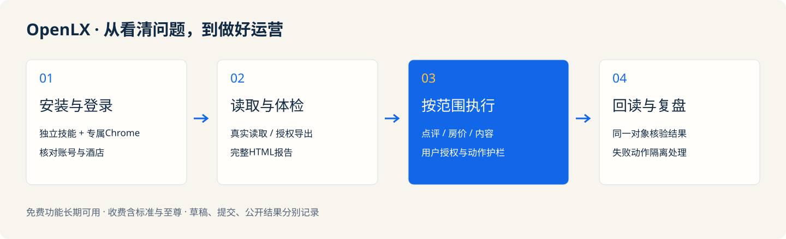
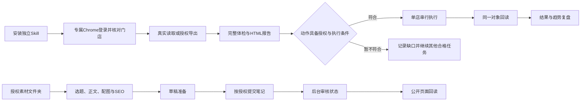

# OpenLX 携程酒店运营助手


**把繁琐留给助手，把时间留给客人。**

面向酒店、客栈与民宿的独立运营技能。免费完成经营体检、完整HTML报告与点评处理，收费版扩展持续跟踪、收益策略与内容获客。

[官网](https://ctrip.openlx.cn) · [下载安装](https://ctrip.openlx.cn/#install) · [完整报告示例](https://ctrip.openlx.cn/reports) · [使用说明](https://ctrip.openlx.cn/docs) · [能力状态](skills/openlx-ctrip-hotel-ops/references/status.json)

> **当前版本0.1.1：本地功能可运行，真实酒店账号适配待验证。** 代码实现、模拟测试、后台操作和公开回读分别记账。收费尚未开放；完整权益目标保留，不把生成草稿当成已发布。

## 12项优势

以下为完整权益目标；当前已验证范围与待验收项目见[能力状态](skills/openlx-ctrip-hotel-ops/references/status.json)。

| 优势 | 能为门店做什么 |
|---|---|
| **专属Chrome，登录状态持续复用** | 独立Chrome配置文件、门店身份核对、会话失效提醒与人工续登。 |
| **全店深度体检，先找真正的问题** | 资料、房型、房态、价格、订单、活动、点评一起检查，按影响和可执行性排优先级。 |
| **完善门店资料，把特色变成卖点** | 酒店介绍、设施政策、房型文字、主图和图片顺序形成改良清单。 |
| **房型套餐与活动算账，看清实际到手** | 诊断早餐、取消政策、连住套餐、附加产品和优惠叠加，避免卖得多却赚得少。 |
| **房态巡检与策略，减少漏卖和超卖风险** | 检查未来房态、渠道库存、开关房和异常日期，按库存权威来源形成策略。 |
| **有依据地调价，不做盲目降价机器人** | 结合本店预订进度、价格底线、可比同行、需求事件输出可解释的价格建议。 |
| **锁定真正同行，持续跟踪可比价格** | 建立并维护竞争酒店集合，同日期、同权益、同条件对比和追踪。 |
| **跟着节日和周边需求提前做准备** | 节假日、演唱会、展会、考试、节庆及天气等形成需求日历和行动提示。 |
| **订单异常提醒，生成今日接待清单** | 新单、取消、临近入住、连住、多房、接送和特殊要求形成运营任务。 |
| **好评自动回，差评先确认** | 基于真实点评、门店事实和口吻生成商家回复，同时提炼服务整改建议。 |
| **素材放进文件夹，持续产出携程笔记** | 至尊版读取授权素材，自动策划、写作、配图、搜索优化和发布；包年增加人设蒸馏。 |
| **HTML运营报告，建议落实后继续复盘** | 从问题证据、动作清单到执行结果和趋势形成经营闭环；付费报告去推广署名。 |

## 操作流程





## 免费与收费

**免费功能长期可用，收费包含标准和至尊。没有试用期、优惠券或兑换券，默认不自动续费。**

| 套餐 | 月付 | 季付（3个月） | 年付（12个月） | 核心权益 |
|---|---:|---:|---:|---|
| 免费版 | 0元 | 0元 | 0元 | 完整体检、全部问题、好评授权自动回复、差评确认、基础比价 |
| 标准版 | 19.9元 | 39.9元 | 99.9元 | 持续跟踪、基础自动调价、去推广署名报告、趋势 |
| 至尊版 | 69.9元 | 129.9元 | 399.99元 | 多信号策略、素材到笔记生产发布、首次定制、包年人设蒸馏 |

数量和频率为可调整建议；正式销售前公示，已售权益保存快照。外部模型、付费数据与素材费用单列，不包含无限算力或无限人工。实际账号、PMS、提交与回读的缺口见能力状态。

## 安装并运行

需要Node.js 22.20+。下载官网或GitHub Release的实际ZIP，按SHA-256校验后解压。

```sh
cd openlx-ctrip-hotel-ops
node scripts/install.mjs install
```

默认安装至用户目录`.codex/skills/openlx-ctrip-hotel-ops`，可通过`--target`指定其他宿主的技能目录。安装器安装依赖并运行doctor。也可进入技能目录手动执行：

```sh
npm ci
node scripts/ops.mjs doctor
node scripts/ops.mjs init --workspace /path/to/hotel-work --hotel example-hotel --name 示例客栈
node scripts/ops.mjs import --workspace /path/to/hotel-work --file references/example-snapshot.json
node scripts/ops.mjs report --workspace /path/to/hotel-work
```

示例数据只用于本地演示；使用真实数据时按[运行说明](skills/openlx-ctrip-hotel-ops/references/runtime.md)设置来源与门店。

更新使用`node scripts/install.mjs upgrade`；旧版本会备份。`rollback`恢复备份，`uninstall`将技能移至可恢复备份，外部酒店工作区数据保留。Windows脚本已提供，真实系统验证尚未完成。

## 登录、支付和数据

官网注册登录复用wx.openlx.cn的OpenLX账号与邮箱验证服务，SMTP相同。携程订单、酒店绑定、设备、签名许可和人工服务工单独立存储。支付模块复用原微信支付与支付宝配置；真实支付交易尚未执行，当前不开放收费。

许可证绑定本机设备ID，守护运行自动在线续取；登记的付费写任务使用服务器单店租约，真实双设备操作仍待实测。

浏览器Profile、Cookie、客人身份信息不上传官网，也不进入本仓库。报告默认本地保存、可离线打开。支付私钥、SMTP配置、运行数据库不包含在发布物中。

## 当前验证

- 本地报告、点评分流、价格护栏、素材与人设、许可和支付账本有可运行代码与回归测试。
- macOS与Linux已实际安装、运行doctor并生成演示报告；Windows尚未实测。
- 实际携程字段、改价、接单、点评提交、笔记提交及公开状态还没有账户实测。
- 专属浏览器和笔记分阶段执行器已实现，字段映射必须来自实际账户，未内置虚构选择器。
- 内容支持规则模板、人设及用户选择的模型API；日程执行器已实现，真实模型连接、长期运行和笔记自动提交仍需实测。

完整实现说明见[IMPLEMENTATION.md](docs/IMPLEMENTATION.md)，原46项验收及42项能力映射均保留；逐项状态见[status.json](skills/openlx-ctrip-hotel-ops/references/status.json)。

## 开发与自检

```sh
npm ci
npm test
npm run build
npm start
```

本地官网运行于http://127.0.0.1:1986。生产接入见`.env.example`，通过`OPENLX_SHARED_ROOT`加载服务器既有支付模块，不复制商户密钥。

## 服务群与个人联系

| OpenLX服务群 | 技术总监微信 |
|---|---|
|  |  |

二维码与wx.openlx.cn相同。主视觉由imagegen生成，用于产品概念展示；素材来源与提示词见[VISUALS.md](docs/VISUALS.md)。

独立第三方辅助工具，非携程官方产品。OpenLX 携程酒店运营助手｜法匠科技提供技术支持。源码再分发授权协议尚未指定，公开展示不自动授予无限商业再分发权。
